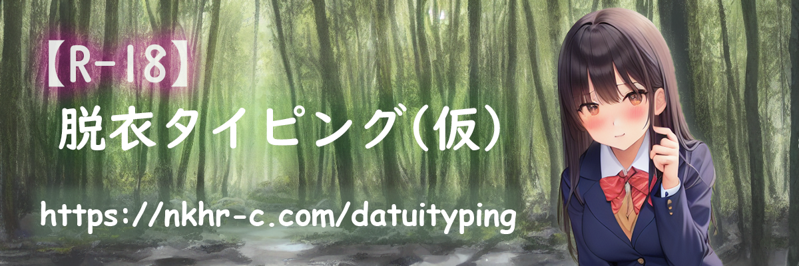

  
***
Undress her with your typing.
***
  
  
---
  
  
## 義務
* 画像にモザイクをかける
  
## 問題
  
## 課題
* 画像、増やそう
* 画像に合わせて入力欄の位置（top）を調整
* 3層にして半透明ブロックを挟む？
* 難易度EXTRA（すべきー200 or たじさく1000）
* 難易度EDIT（自由難易度・自由画像）
* 選択中のレベルのボタン色うすくする
* 入力数・秒数でプログレスバー
  
## 要検証
* ミスしたときに知らせる何か　inputの枠赤くする？
* ブロックやイラストのサイズを相対的に
* 解禁済みの画像を保存・表示(localStorage)

## そのうちやる
* AOSつかってなんかいい感じに
* ブロック破壊時エフェクト強化、爆発させたい
* jsファイル分割
  
## たぶんやらない（やれない）
* 効果音(on/off、音量調整もセット）
* 諸々リファクタリング
* 入力欄、inputじゃなくてdivでいいじゃん→よくないかも
* NormalクリアでEXTRA出現みたいなの（いらんかも）
